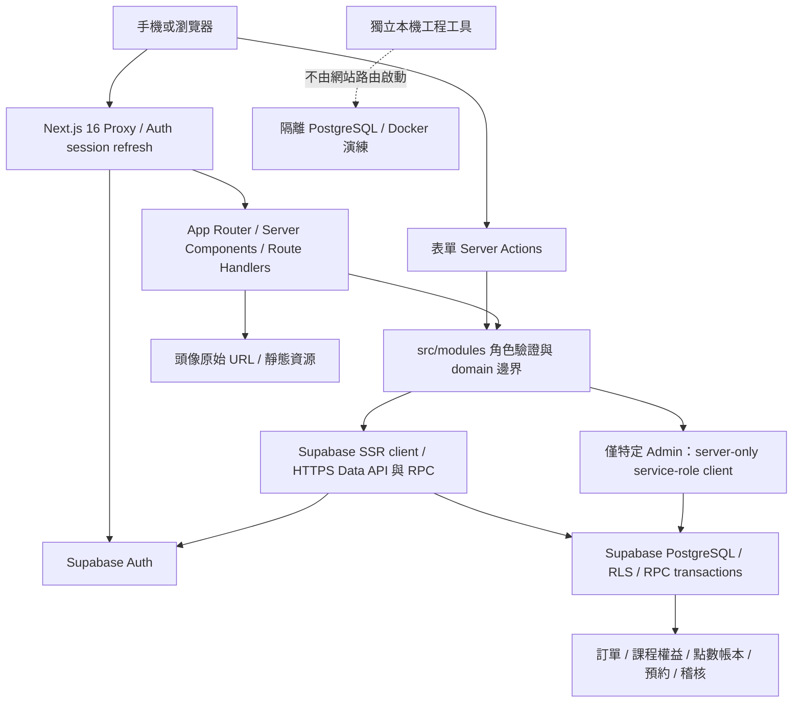

# CURRENT_THE_ONE_RUNTIME_ARCHITECTURE

## 現行增補：Preview Mock data boundary（2026-09-08）

Cloudflare Worker / vinext 使用原本 30 個 page files、Server Actions 與角色路由。
只在 Supabase client factory 注入 in-process fetch adapter；domain service 留在 src/modules。
資料集中 src/lib/preview/fixtures.ts；HTTPS preview.invalid 是 SDK 內部保留假地址，adapter 不呼叫網路 fetch。
三個公開 demo 身份只用來顯示既有 UI，不是真 Auth security implementation。
任何資料修改與未知 RPC 都拒絕；既有正式資料來源仍需原本 env，不會自動 fallback mock。
明確旗標 NEXT_PUBLIC_DATA_MODE=mock、NEXT_PUBLIC_APP_ENV=preview、THE_ONE_ENV=preview；
Worker 比對 build/runtime，production+mock、未知 mode 或混入 Supabase 設定 fail closed。
[現行部署與限制](THE_ONE_CLOUDFLARE_PREVIEW_DEPLOYMENT.md)。下列是保留的 hosting audit 基線。

2026-09-08，AUDIT ONLY。檢查基線：`preview-test` / `d3821e3a6fec98c0fe72ba280e705e7bf6f3bc79`，起點 CLEAN。
實際目錄：`C:/Projects/the-one-platform-handoff-0af0680`。不是桌面預設的舊 `C:/Projects/the-one-platform`。
本文件是 hosting 評估的程式證據，不取代 Canonical 文件，不宣告部署或功能通過。
位置以此基線的 repository 相對路徑與行號表示；無命中是本次靜態掃描結果，不代表外部服務一定不存在。

## 1. 現有執行架構

瀏覽器 client 工廠已存在（`src/lib/supabase/browser.ts:5`），但全 `src` 搜尋只找到其宣告，未找到呼叫者。
因此圖中的實際業務讀寫走 server；不能把「已有 browser client」說成已做 Realtime、Storage 或 browser 直寫。

## 2. Framework / rendering

| 證據位置 | 實際結論 |
| --- | --- |
| `package.json:13`、`pnpm-lock.yaml:9` | Next **16.3.3**；React / React DOM **19.2.8**；Supabase SSR **0.12.5**、supabase-js **2.112.4**。不是只看 semver 範圍；lock 已固定版本。 |
| `src/app/layout.tsx:20`、`src/app/page.tsx:1`；全路由盤點 | App Router；30 個 page、5 個 Route Handler，沒有 `pages/` 或 `src/pages/`。 |
| `src/modules/teachers/public-discovery.ts:41` → `src/lib/supabase/server.ts:7` | 公開老師資料也經 server client / `await cookies()`；屬請求時資料路徑。保護頁另查身分。不是全站靜態頁。 |
| `src/app/page.tsx:1`、`next.config.ts:3` | 首頁本身可靜態呈現；沒有 static export 設定。本輪未 build，不給精確 SSG/SSR 產物分類數量。 |
| 全 `src` 的 directive 掃描；`src/app/layout.tsx:20` | 沒有應用自行宣告的 `use client` 元件；pages/layouts 採預設 Server Components。Next Link/Image 等套件內 client 邊界仍存在，不能稱完全零 client JS。 |
| `src/modules/commerce/actions.ts:3,10`、`src/modules/scheduling/actions.ts:5,51`、`src/modules/entitlements/actions.ts:4,31` | 使用 `revalidatePath`，不是完全不使用快取 API。 |
| 全 `src` / `next.config.ts` 掃描 | 沒有 `generateStaticParams`、明確 `export const revalidate`、`unstable_cache`、`use cache`、cacheComponents 或自訂串流實作。未實作明確 ISR 策略；框架 RSC/streaming 能力不等於已有串流產品。 |

本機 Next 隨附指南：`node_modules/next/dist/docs/01-app/01-getting-started/05-server-and-client-components.md:12` 說明 pages/layouts 的預設 server 行為。
首頁目前只是 Platform Foundation，已有 Auth、師資、商品、體驗課、訂單、課程方案及排程表單；尚非可買入旗艦 System Course 並學習的完整產品。
路由數不代表完成比例。細節見 [既有 Preview 盤點](THE_ONE_VERCEL_PREVIEW_SETUP.md)。

## 3. Server-side 與 session

| 入口 / 位置 | 行為與 hosting 需求 |
| --- | --- |
| `src/proxy.ts:5,9` | 全站 session refresh，排除 `_next/static`、`_next/image`、favicon 與部分圖像副檔名。涵蓋首頁、Auth、health、webhook。 |
| `src/lib/supabase/proxy.ts:6,16,33` | 使用 SSR `getAll/setAll`，同時更新 request/response cookies，呼叫 `auth.getClaims()`。GET 不是零 Auth 活動的保證。 |
| `src/lib/supabase/server.ts:7,16,25` | `await cookies()`；Server Component 不可寫 Cookie 時由 Proxy 負責刷新。不能刪除 Proxy 來湊相容。 |
| `src/modules/auth/session.ts:17,22,30`、`server-authorization.ts:12` | `getUser()` 驗身分，查 account status / roles；Student、Teacher、Admin、Super Admin 邊界仍由 server + DB 控制。 |
| `src/modules/auth/actions.ts:22,50,70,77,94` | 註冊、密碼登入、登出、重設郵件、更新密碼；原生表單 Server Actions。 |
| `src/app/auth/callback/route.ts:7` | code → `exchangeCodeForSession`，受信任站點 origin + safe redirect。 |
| `src/app/auth/confirm/route.ts:22` | OTP 類型 allowlist、`verifyOtp`、受信任 origin。 |
| `src/app/lesson/[id]/join/route.ts:1` | 重新驗證參與者再導向會議，不能公開 meeting locator。 |
| `src/app/api/payments/[provider]/webhook/route.ts:2` | POST 先讀 raw text、Headers 交給 provider；目前 provider 一律 null，回 501。不是可收款 callback。 |
| `src/app/api/health/route.ts:1` | handler 回狀態 JSON；整個 HTTP 仍經 Proxy，不可當全站零外部連線探針。 |

Server Action 模組共7檔：Auth、Commerce、Entitlements、Trials、Scheduling、Teachers actions、Teachers admin-actions（各檔 `:1`）。
表單使用 FormData 的文字欄位；未發現 `File` 上傳處理或 multipart 檔案儲存流程。
Redirect 使用 `next/navigation` / `NextResponse.redirect`；`next.config.ts` 無自訂 headers、redirects、rewrites；未找到 CSP 實作。
這不表示雲端已無安全標頭，因目前沒有實際 The One hosting 設定證據。

## 4. Runtime

沒有 route `runtime='edge'` 或自訂 runtime 宣告。採 Next 預設 Node server 執行模型；Proxy 為 Next16 Node runtime。
本機指南 `node_modules/next/dist/docs/01-app/03-api-reference/03-file-conventions/proxy.md:255` 明示 Proxy 不可設定 runtime 選項。

| 能力 | 實際使用 |
| --- | --- |
| Node crypto | `src/app/teachers/[slug]/trial/page.tsx:1` 的 `node:crypto.randomUUID`；其他表單用 global `crypto.randomUUID()`，例如 `src/app/admin/schedule/page.tsx:24`。 |
| fs / child_process | 網站 `src` 未找到；`scripts/epic7-local-db.mjs:1`、`tools/epic7-local-engineering/pg-local.mjs:1` 有，屬本機操作工具，不是 web request dependency。 |
| streams / sockets / PG driver | 未發現應用手寫 Node streams、TCP PG client、常駐 server 或 websocket server。Supabase JS 使用 HTTP client；不可把本機 PG 工具打包成 hosting function。 |
| native modules | lock 內 Next 的 SWC/sharp、Tailwind/Lightning CSS、lint resolver 等 build 依賴；`pnpm-workspace.yaml:1` 明列忽略 sharp/unrs-resolver build scripts。src 未直接 import native addon。 |
| long-running / background | 無應用 cron、queue consumer 常駐程序、`next/after` 或 timer job。DB outbox/SQL function 不等於有排程器驅動。 |
| timezone | `src/modules/scheduling/timezone.ts:12,49,73` 用 Intl/IANA，逐15分鐘掃 ±14h，約113次轉換以拒絕 DST 歧義；這是需要量測 CPU 的實際熱點。`src/modules/trials/timezone.ts:37` 亦做轉換。 |

## 5. Supabase / Commerce / Scheduling

- Database：`src/modules/commerce/data.ts:1` 與各 domain data/actions 透過 `.from()`、`.rpc()`；PostgreSQL 內負責交易、鎖、RLS、grants、idempotency，hosting 不是交易管理者。
- Auth：`src/lib/supabase/{browser,server,proxy}.ts:1`；service-role 工廠 `src/lib/supabase/admin.ts:7` 設 `autoRefreshToken/detectSessionInUrl/persistSession=false`。
- 特權使用實例：`src/modules/teachers/admin-actions.ts:22,36,48,67,100` 驗 Admin 後更新角色/老師/能力/專長；不能把 service-role 搬進 browser，也不能把所有 RPC 改 service-role。
- Commerce：`src/modules/commerce/actions.ts:9` checkout，`:10` 匯款申報，`:12–15` 人工確認/拒絕/現金/取消；`src/modules/payments/manual-providers.ts:3` 明確不接受 webhook。
- Outbox：`supabase/migrations/20260901000200_commerce_products_orders_payments.sql:158`；fulfillment RPC `20260901000500_entitlement_lesson_credits.sql:329`；entitlements `:52`、ledger `:116`。`src/modules/entitlements/actions.ts:56` 有 Admin retry。未找到自動 reconciliation scheduler。
- Scheduling：`src/modules/scheduling/actions.ts:27,174,228,281,314` 分別 flexible booking、recurring series、單次 materialize、makeup、完成。點數仍走同一 DB ledger，不能因 Workers 有 Cron 就聲稱已自動產課。
- Storage / Realtime：掃描 `src`、migration 無 `.storage`、channel subscribe、storage bucket/policy、Supabase Realtime publication 設定命中。套件含功能不代表已接線；外部 bucket/Realtime 開關 UNKNOWN，未登入查詢。
- Connection strategy：現有網站不需要 DATABASE_URL、PG密碼、Supabase management token 或新的 connection pool。HTTP RPC 交易留在 Supabase。

## 6. 檔案與外部整合

| 項目 | 已實作 / 尚未實作 |
| --- | --- |
| Image | `src/components/teachers/teacher-avatar.tsx:1,33` 使用 Next Image，**明確 unoptimized**；沒有圖片時顯示名字首字。不是已依賴 Vercel Image Optimization。 |
| Fonts | `src/app/layout.tsx:2,5,10` 使用 next/font/google 的 Geist / Geist Mono；Next build 取字型並自託管。換工具鏈需核對是否改成瀏覽器連 Google。 |
| PDF / Audio / Backing Tracks | `docs/CANONICAL_ROADMAP.md` Epic9；`docs/SYSTEM_ARCHITECTURE.md` Resource-provider boundary。目前是泛用資源模型及未來產品需求，沒有上傳/簽名 URL/delivery service。 |
| LINE / VdoCipher / OpenAI | `.env.example:6–14` 保留名稱；src 無實際 client 或呼叫；不是當前 build 必需秘密。 |
| Email | Auth 註冊/忘記密碼由 Supabase Auth 發信流程；無應用 SMTP/Resend SDK。SMTP/寄件政策仍屬外部環境條件。 |
| Payment | provider-neutral interface 已有 create/verify/query/refund 入口（`src/modules/payments/provider.ts:2–5`），沒有正式 gateway adapter。 |
| Meeting | 已有受保護 join 導向；不是內建直播/錄影平台。 |
| Analytics / video APIs | 無 @vercel/analytics、Blob/KV/Edge Config、LINE或影片 SDK 直接依賴；`public/vercel.svg` 僅素材，不是平台綁定。 |

## 7. Build / environment / delivery assumptions

| 設定 | 已核對事實 |
| --- | --- |
| Build | `package.json:5`：dev=next dev、build=next build、start=next start、lint=eslint、typecheck=tsc --noEmit、test=vitest run；無 codegen/postinstall/migration-on-build。 |
| Tools | packageManager=pnpm@10.34.5；package 無 engines。Next 安裝套件 `package.json:136` 要 Node >=20.9；不能據此認定所有依賴只需20.9，lock 部分工具門檻更高。公司已備 Node24.19.0，不代表 Cloudflare runtime 是 Node24。 |
| TS/CSS/tests | `tsconfig.json:2` strict、bundler resolution、@/*；`postcss.config.mjs:1` Tailwind4；`vitest.config.mts:1` Node test environment。現有測試不是 workerd 或瀏覽器 E2E。 |
| Public env | `src/lib/env/public.ts:10`：NEXT_PUBLIC_SUPABASE_URL / NEXT_PUBLIC_SUPABASE_PUBLISHABLE_KEY；無效/缺值拋錯。 |
| Site env | `src/lib/env/server.ts:30`：NEXT_PUBLIC_SITE_URL 明確受信任 origin；只 development 可 fallback localhost。Preview production-mode 不享此 fallback。 |
| Secret env | `src/lib/env/server.ts:15`：SUPABASE_SERVICE_ROLE_KEY，僅特權路徑必要；`src/modules/payments/instructions.ts:2`：MANUAL_BANK_TRANSFER_INSTRUCTIONS 可選。 |
| Build-time | Next 公開變數在 build 固定；不可把含正式 public URL/key 的產物當 Preview。雲端 build 的完整 env demand 未實跑，不能承諾所有頁面 build 零後端接觸。 |
| Platform coupling | 全 src/package/next.config 掃描無 VERCEL_*、@vercel 套件、Blob/KV/Edge Config/cron 綁定；沒有依賴 VERCEL_URL 自動回呼。 |
| Hosting files | git ls-files 無 vercel.json、.vercel project link、.github workflow、Dockerfile/compose、.openai hosting。next.config 是空設定；不能把 docs 提案視為實際部署設定。 |
| Artifacts | `.gitignore:16,34,44` 排除 .next、env、dump、私有資料與remote-smoke artifacts；未來 Cloudflare需額外排除其本機secret/build檔，現在未改。 |

## 8. 狀態與界線

依序讀取 CURRENT_WORK、PROJECT_STATUS、CANONICAL_ROADMAP、PRODUCT_DECISIONS，再讀 MASTER_PRD、SYSTEM_ARCHITECTURE、DATABASE_DOMAIN_MODEL、BUSINESS_RULES、SECURITY、MIGRATION_PLAN、既有 Preview 文件與上述程式。
部分架構文件保留 Draft / 歷史 F NOT AUTHORIZED 文字；工程現況以 CURRENT_WORK/PROJECT_STATUS 最新段落為準，不能從舊段倒退。
Epic7 本機與 Production Read-Only Preflight 已完成至既定 gate；remote29/local34、Backup/Recovery 未過、Epic7 REMOTE CLOSED=NO。此稽核未重查正式 DB。

Epic7 → Epic8 → Epic9 → Epic10 → Epic11 → Epic12 → Epic13 順序不變。
The One 2.0 != The One Guitar Roadmap 2.0；Membership != System Course；
Content != Product != Commerce != Payment != Entitlement != Achievement。
沒有新增 Epic8 功能或將 R2 等未來供應商選項升為 blocker。

驗證方式：檔案讀取、route/directive/import/env/static configuration 掃描；無安裝、build、dev server、SQL、Docker、正式 DB connection 或 deployment。
平台相容性、成本與選擇見 [Cloudflare Hosting Evaluation](THE_ONE_CLOUDFLARE_HOSTING_EVALUATION.md)。
