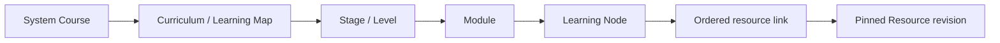

# Epic 7 — Learning Map Core: Scope Definition and Approval Package

Status: **APPROVED PLANNING BASELINE ESTABLISHED; LOCAL A–E AUTHORIZED**.
Governance review date: 2026-09-06, Asia/Taipei.
Canonical synchronization: **COMMITTED AND PUSHED** in `588811d1d5617788b162f4e0a275d64d6a248dce`.
Epic 7 implementation: **LOCAL A–E COMPLETE / LOCAL CLOSED; REMOTE F NOT AUTHORIZED**.
The four Product Owner decisions are approved; they are not open questions.
Technical names below are proposals constrained by those decisions. The
subsequent Product Owner LOCAL autonomous authorization and per-slice contracts
are recorded in [Epic 7 Local Execution](EPIC7_LOCAL_EXECUTION.md). Historical
review statements below describe preparation, not current authorization.
Local A–E commits are authorized; remote operations and F require a new gate.

## 1. Historical planning baseline, authority, and consistency findings

The incorporation and synchronization preflights reconfirmed `main`, with HEAD and local `origin/main` both
`82b1f25e6db3075c4d619c19440e4e94d20891c8`, ahead/behind `0/0`, and a clean
tracked tree. The only working-tree entry at the start of synchronization was
`?? docs/EPIC7_SCOPE_DEFINITION.md`, the prior uncommitted planning document;
the entire working tree was therefore not clean. The earlier initial planning
audit had a clean tree before this document was created. At that planning gate
there were 29 migration files. Local A–E subsequently added five migrations;
see execution evidence for the 34-file local chain. No remote database or
fresh remote Git query was made during the planning review.

Git history shows `82b1f25` is the eight-document P2 closure commit. Both local
production smoke artifacts were found, and their SHA-256 hashes match
[P2 closure evidence](P2_REMOTE_CLOSURE_EVIDENCE.md). This corroborates the
recorded historical PASS results; no production smoke, restore or parity check
was rerun. CURRENT_WORK and PROJECT_STATUS both pass the P2 discrepancy check.

Read in canonical order: [Current Work](CURRENT_WORK.md),
[Project Status](PROJECT_STATUS.md), [Canonical Roadmap](CANONICAL_ROADMAP.md),
and [Product Decisions](PRODUCT_DECISIONS.md). Also reviewed the
[PRD](MASTER_PRD.md), [architecture](SYSTEM_ARCHITECTURE.md),
[domain model](DATABASE_DOMAIN_MODEL.md), [business rules](BUSINESS_RULES.md),
[permissions](ROLE_PERMISSION_MATRIX.md), [security](SECURITY.md),
[migration plan](MIGRATION_PLAN.md), [recovery runbook](REMOTE_BACKUP_RECOVERY_RUNBOOK.md),
[historical roadmap](DEVELOPMENT_ROADMAP.md), and
[Learning Map module boundary](../src/modules/learning-map/README.md).
Product constraints also come from [repository instructions](../AGENTS.md),
[Guitar Roadmap principles](guitar-roadmap/README.md),
[student pain points](guitar-roadmap/student-pain-points.md), and
[membership philosophy](guitar-roadmap/membership-model.md).

| Finding | Evidence and interpretation | Disposition |
| --- | --- | --- |
| P2 COMPLETE; Epic 5 and Epic 6 REMOTE CLOSED | Current Work and Project Status agree with the prior closure evidence. Remote Deployment, BR-1/2/3, and both production smokes are recorded PASS; parity 29/29, latest `20260904001100`. These are historical verified results, not checks rerun here. | Preserve. No conflict with current repository implementation was found. |
| Two different Git baselines have different purposes | `899906b556b4dc282538920baec8cdfb0546f6df` is the historical smoke execution baseline; `82b1f25...` includes closure documentation. | Not a discrepancy. Do not rewrite historical evidence to the planning SHA. |
| Prior stale supporting delivery descriptions | SYSTEM_ARCHITECTURE, MASTER_PRD and DEVELOPMENT_ROADMAP previously retained local/pending-remote descriptions. | Resolved by the authorized canonical synchronization; historical Epic-specific exclusions remain labeled as history. P2 closure is unchanged. |
| Stage 1–5 versus Level 1–6 | DDL preserves the five-stage legacy base; AGENTS and guitar-roadmap define six flagship outcomes. E7-PO-01 approves coexistence, not equivalence. | Supporting documents now explicitly distinguish preserved legacy references from additive course-scoped Levels. No implicit mapping or 1:1 identity binding. |
| Proposed LMS records are not deployed LMS | Architecture/domain documents explicitly label learning maps, nodes, resources, progress, and review tables as proposed. The learning-map module contains only a README. | No completed Epic 7 implementation was found; consistent with PROJECT_STATUS. |
| Membership feature examples span later epics | Guitar membership guidance describes practice/review/assessment visions. Accepted Product Decisions make membership platform-level. | Examples do not authorize Epic 8–13 implementation in Epic 7. |
| Payment boundary remains open | Production payment-provider webhook processing is NOT COMPLETE. | Blocks full production payment closure; does not reopen P2 or block this structural Epic 7 proposal. |

The initial audit found no earlier dedicated Epic 7 scope package. This review
updates that package using the Product Owner's explicit approval handoff titled
“Epic7 Product Approval Incorporation → Final Governance Review → Approved
Planning Baseline Preparation,” received in this task. Section 14 records the
four approvals without relying on a private attachment path for future readers.
No entry in PRODUCT_DECISIONS.md or Epic 7–13 numbering is changed here.
The subsequent Canonical Document Synchronization instruction authorizes
limited supporting-document corrections recorded in section 18, not new
product decisions, implementation or a commit/push.

The prior package's public-outline proposal, prohibition of Self Complete,
pending Q1–Q4 alternatives, and Admin production-publishing scope are superseded
by these approvals. No conflict with accepted PD-001–PD-015 was found: a Free
main-resource direction remains policy-controlled, and self-reported progress
never becomes the verified outcome required by the capability-first principles.

## 2. Existing-state audit — EXISTING, not proposed

| Existing record / surface | Actual responsibility and evidence | Constraint on Epic 7 |
| --- | --- | --- |
| `learning_map_stages` | [Epic 2 migration](../supabase/migrations/20260831000200_teacher_profiles_public_discovery.sql): `stage_number` smallint PK restricted to 1–5, unique `code` matching `stage_[1-5]`, display name; five deterministic seeds. No course UUID, curriculum, or publication identity. | Cannot represent arbitrary courses or a sixth Level without changing existing meaning. Keep intact. |
| Five stage labels | `0 到 1 基礎伴奏篇`, `技巧精煉／伴奏篇`, `樂理指板篇`, `聽寫轉換篇`, `改編創作篇`. | Existing teacher/trial classification, not an approved mapping to the six new capability outcomes. |
| `teacher_stage_capabilities` | Composite PK `(teacher_profile_id, stage_number)`; FKs to teacher profiles and the five-stage catalog; status `allowed` / `certified`, assignment actor/time. | No implemented `teach/review/assess/mentor/content_author` action dimension. Existing certification must not confer new-course review, edit, or access rights. |
| `student_profiles.current_stage` | Nullable FK to the five-stage number; onboarding/learning-goal profile in the [Epic 3 migration](../supabase/migrations/20260831000400_student_teacher_trial_flow.sql). | A placement hint; neither course enrollment nor node progress. No conversion to verified progress. |
| `lesson_records.stage_number`, `assessments.primary_stage` | Nullable FKs to that same catalog. Records include notes, next goal and homework text; assessments are `teacher_trial_assessment` linked to a Trial Lesson. | Preserve historical assessment meaning. These are not Epic 9 homework, Epic 10 verification, or Epic 11 certificates. |
| `lessons`, relationships, bookings and credits | Existing one-on-one scheduling and entitlement domains. A Lesson is a real scheduled occurrence. | Do not name recorded content `lessons` or reuse Lesson IDs as learning nodes. No credit or schedule writes in this epic. |
| Teacher catalog / discovery / Admin actions | [catalog](../src/modules/teachers/catalog.ts), [public discovery](../src/modules/teachers/public-discovery.ts), [Admin actions](../src/modules/teachers/admin-actions.ts) read or assign old stage capabilities. | Preserve DTOs and old assignment behavior. The Admin path presently uses a server-only privileged client; do not copy its broad raw-write pattern into new content tables. |
| Stage validation | [Teacher domain](../src/modules/teachers/domain.ts) and [Trial domain](../src/modules/trials/domain.ts) both validate integer stages 1–5. Trial completion migrations also validate against the old catalog. | Do not widen these validators to accept unrelated course levels. Integration needs an explicit future contract. |
| Identity / roles | [Auth domain](../src/modules/auth/domain.ts): student, teacher, admin, super_admin; account active/suspended/disabled. Users can have multiple roles. | Creator is not an existing Auth role. Membership tiers are not roles. |
| Entitlement | [Epic 5 migration](../supabase/migrations/20260901000500_entitlement_lesson_credits.sql) reserves membership/content/resource enum types but implements lesson-package fulfillment. Existing rows have beneficiary, commercial snapshots and teacher scope; no typed System Course FK. | Reserved enum values do not prove course access exists. Do not use teacher scope or JSON config as a substitute for future course policy. |
| Commerce content-adjacent records | Products and public Product catalog, publication requests and order snapshots are commerce records. | A Product is not a System Course, Resource or curriculum publication. Product publishing is not a reusable LMS release workflow by default. |
| LMS implementation | `src/modules/learning-map/README.md` only; no migration-defined `system_courses`, `learning_nodes`, `learning_resources`, or node-progress tables found. | New structural records are PROPOSED below. Existing student learning notes still count as real legacy data to preserve. |

Applied migrations constrain the upgrade even if a past smoke aggregate was
empty. In addition to the original Epic 2/3/5 schemas, Trial security and
schedule-serialization migrations redefine stage-accepting RPCs. The global
lock-order/security tests and later service-role hardening remain regression
contracts. Audit their effective definitions when implementing; never edit any
of the 29 applied files.

## 3. Proposed scope and domain ownership

After separate implementation authorization, Epic 7 would deliver a generic,
versioned learning structure; measurable
objectives and reusable skills; advisory prerequisite relationships; attributed
resources, future capability attachment points, and an owner-only personal
progress foundation including Self Complete. Only minimal internal/Admin
structure inspection is in scope as a surface. Version creation/freeze
primitives support reproducibility and structural tests, not a production
publishing system. No public learning surface, student workspace, Creator CMS,
commercial catalog, enrollment/access engine or premium delivery engine is
an Epic 7 deliverable.

Domain services and authorization belong in `src/modules`, not UI components.
The platform stewards structure; a contributing author is not its permission
owner or financial beneficiary. The following boundaries remain intact:

- The One platform != its flagship Guitar Roadmap System Course.
- Membership != System Course; Membership != Authorization Role.
- Content != Product != Commerce != Payment != Entitlement != Achievement.
- Content Author != Access Authority != Revenue Owner.
- Product Type != Billing Model != Entitlement.
- Credit != Booking != Lesson; Booking Mode != Billing Model.
- AI != Formal Verifier.
- Prerequisite != Content Access != Entitlement; Prerequisite != Verification
  and Prerequisite != Assessment.
- Self Complete != Verified != Mastered != Assessment Passed != Certificate Earned.

All entries below are **PROPOSED**, including names. UUID means a durable
identity, never an access token. A revision key identifies historical content;
changing a slug or order must never change identity.

| Entity | Purpose / owner | Identity and lifecycle | Relationships and Epic 7 decision |
| --- | --- | --- | --- |
| SystemCourse | First-class learning system; Course domain/platform stewardship | UUID, globally unique stable slug; draft, active, archived identity; versioned presentation metadata | Owns curricula and content identities. IN; no Product, Plan, teacher-owner or price dependency; activity never creates course membership. |
| Curriculum / LearningMap | One structured map belonging to a course; Learning Map domain | UUID, course-scoped slug; draft, immutable version snapshots, archived | Course 1:N curricula; optional current structural version pointer for internal inspection, not public/student visibility. IN; navigation UI deferred. |
| Stage / Level | Course-local grouping and capability outcome; Learning Map domain | UUID, course-scoped slug; placement/title/outcome versioned with release | Exactly one curriculum placement per release. IN, called `curriculum_stages` to avoid old catalog collision. No global 1–5 or 1–6 limit. |
| Module | Coherent grouping of nodes; Learning Map domain | UUID, course-scoped slug, versioned ordered placement | One stage parent per release. IN; no optional parent shortcuts in v1. |
| LearningNode | Smallest structured learning unit, not scheduled Lesson or one video | UUID, course-scoped slug; versioned objective, guidance, standard context | One module per version, variable resource links and optional supported-capability descriptors, objectives, skills and advisory edges. IN. |
| Resource | Provider-neutral instructional material; Content domain | UUID owned by a course; immutable revision UUID once frozen into a version; draft/retired identity | Variable ordered node links can pin the same revision. IN: kind, purpose, title, safe description, private provider reference and attribution. Main/practice video, PDF, audio, backing track, text or self-check instructions are data, not fixed per-node columns or tier assignments. Delivery/player/upload workflows deferred. |
| Capability attachment point | States what a course/node structurally supports; Content domain | Stable target and attachment ID with versioned capability code/descriptor | IN as metadata/reference contract for submission, async review, verification, assessment and other approved capabilities. Optional subset per node; no student eligibility, quota, reviewer, workflow state or result. Concrete workflow tables deferred to their epics. |
| LearningObjective | Observable capability expected of a node; Learning Map domain | Durable objective UUID under node plus release revision; new identity if outcome meaning changes | At least one per Node in a frozen version. IN. Optional module/stage outcome summaries are fields; no separate objective graph needed. |
| Prerequisite | Recommended prior node relationship with rationale; Learning Map domain | Composite `(publication, dependent_node, prerequisite_node)` | Same course and release, advisory DAG. IN at node level. Module/stage-level executable edges deferred. |
| Skill | Reusable capability vocabulary; platform learning domain | UUID and unique stable code; active/retired, release pins definition text/version context | Reused across courses. IN; breaking semantic change creates a new Skill identity; no competency score engine. |
| SkillMapping | Explicit relationship of an objective to one or more Skills | Composite `(publication, objective, skill)` | IN; metadata describes intended learning, never proves learner mastery. |
| Contributor / authorship | Traceable author credit metadata; Content domain | Contributor UUID, optional private Auth linkage, approved display credit; ordered author links frozen per release/resource revision | Multiple Teachers or non-Teacher Creators per resource/course. IN as metadata, not a public surface. No role, edit permission, ownership percentage or payout implied. |
| PublicationVersion | Reproducible course/curriculum/standard context; Learning Map domain | UUID, increasing version per curriculum, base version, created/frozen actor/time | IN: mutable draft and atomically frozen content snapshot only. Historical name does not authorize public release. Production publishing, approval queue and Draft → Review → Publish workflow are Epic 13. |
| LearningProgress foundation | Learner's usage, self-reported completion and resume state; Progress domain | Unique `(student_user_id, publication_id, node_id)` with opened times, resume reference, revisit flag, explicit self-completion marker/time | IN; private and version-bound. Self Complete is personal state only; no mastery, VERIFIED, formal stage completion or assessment outcome. Workspace/button UI deferred to Epic 9. |

No Creator role, course collaborator editor, resource-marketplace sharing,
rubric engine, enrollment billing row, or generic workflow framework is needed
to fulfill this minimum. Those are distinct from the entity metadata above.

## 4. Hierarchy, identity, ordering and archive rules

The Resource link is a relationship, not an extra product hierarchy level.
Here and below, a structural “release” or `publication_id` means a frozen
version foundation, not a publicly published product. A draft may be incomplete.
A valid frozen curriculum version requires at least one
stage; each included stage requires a module; each module a node; each node
an objective and at least one resource. A text instruction qualifies as a
resource: video is not mandatory. Important nodes retain explicit Learn,
Practice, Apply and Verify guidance as instructional content, without running
the future practice or verification workflows. All six hierarchy layers are
mandatory in a released map; the number and labels of groups are course data.

Product Owner clarification after autonomous authorization: **0..N Resources
applies to draft/construction; frozen/publish-ready Nodes require 1..N Resources
and at least one Learning Objective**. No fixed resource kinds or combination
is required. This clarifies the existing rule, without expanding scope.

Parent identity is release-scoped. Composite references bind every placement
to the same course and publication. Node identities cannot appear twice in
one release or belong to another course. Reordering/reparenting creates a
new release; it never rewrites an older frozen parent. Cross-course node
reuse is deferred; copying content creates new scoped identities. Skills may
be shared; shared Resource identities across courses are deferred to avoid
implicit rights propagation. Within a course, resource links may be reused.

Use positive integer positions unique among siblings within a release.
Reorder transactionally under the draft lock; gaps are allowed and numbers
are not IDs, difficulty ranks or prerequisite truth. Slugs are unique in the
course namespace for their entity kind, independent of title and parent.
Reserve stable slugs after first frozen version in v1; public routing and
redirect management can come later. Reserved archived slugs cannot be silently reused.

Archive excludes an identity from new composition/current internal inspection,
but keeps historical placements, authorship and progress references. Referenced releases
and content use restricted deletion. Retiring a node excludes it from a new
release, not an old release. Withdrawal is a separately audited availability
decision: content snapshot survival does not imply perpetual content access.
Unpublished unused draft rows may be removed through the authorized service.

## 5. Multi-System-Course proof and flagship content boundary

Illustrative acceptance fixture, **not approved production content or seeds**:

| Same shared schema | Course A | Course B |
| --- | --- | --- |
| Course | UUID A, `guitar-roadmap` | UUID B, `fingerstyle-foundation` |
| Curriculum/release | Map A / release A1 | Map B / release B1 |
| Stage grouping | Level 1–6 product vocabulary; representative complete Level plus next-Level sample, not six full authored Levels | Two illustrative stages, e.g. pulse and independent voices |
| Module / node | Accompaniment / complete a song | Alternating bass / maintain bass while playing melody |
| Resources | Text + demonstration video revisions | Diagram + audio revisions |
| Skill | Shared stable `steady-pulse` identity | Same Skill identity, distinct objective mapping |
| Authors | Contributors X and Y | Contributors Y and Z, with no Teacher prerequisite |
| Progress | Learner + A1 + node A | Same learner + B1 + node B; isolated state |
| Future access | Policy references A's IDs | Policy references B's IDs; no inherited access from shared Skill or author Y |

Creating B requires rows, no new tables or guitar-specific branches. Core
records contain no fixed string count, guitar tuning, fret number, teacher
owner, Free/Plus/Pro enum, or assumed level count. Such instructional details
live in resource/guidance content; a typed domain extension can be proposed
later if querying them becomes necessary. JSON must not hide essential FK,
authorization, ordering, or lifecycle invariants.

The six flagship outcomes remain exact:

1. 我可以把一首歌完整彈完
2. 我的伴奏不再只有一種
3. 我開始知道自己在彈什麼
4. 我可以慢慢離開樂譜
5. 我可以自己改歌、加旋律、加 Solo
6. 我可以自己處理一首陌生歌曲

**Approved initial depth: Representative Production-like Vertical Slice.**
It must traverse the full hierarchy with multiple Modules and Nodes, at least
one Node with several Resources, Learning Objectives, Skill Mapping, a valid
Prerequisite graph, ordering, and a V1/V2 version-change sample. A complete
representative Level plus a minimal next-Level sample is the planned fixture
shape for cross-Level verification. “Complete Level” here means a coherent
authored structural sample, never a learner's formal Level completion.
The exact sample titles/assets are delivery details; full formal Level 1–6
content entry is explicitly not an Epic 7 closure blocker. Incomplete future
content stays draft. Samples prove structure, not a new production launch.

Level 0 diagnosis is not a mandatory shared schema layer. No diagnostic or
recommendation engine is introduced. The synthetic Course B proves generality
without committing to a second product launch.

## 6. Objectives, skills and prerequisites

An objective says what a learner should be able to do; a Skill is a reusable
concept; a prerequisite recommends what to approach first. None is a learner
achievement. A node may have multiple objectives and an objective multiple
Skills. Node guidance records practice/application expectations and descriptive
verification/pass criteria; Epic 10 later binds actual rubrics and decisions.

Epic 7 uses **approved advisory prerequisites**, with node-to-node DAG edges
as the proposed minimal technical design. An edge
`dependent -> prerequisite` forbids self-links, duplicates, missing endpoints,
cross-course references and cross-release references. Validate acyclicity at
write and version freeze. Serialize graph edits on the same draft before checking
reachability so concurrent inverse edges cannot both succeed. Database
constraints and authorized transactional validation are the final boundary;
browser or unit-test-only graph checks are insufficient.

Module/stage prerequisites in v1 are explanatory summaries derived from node
recommendations, not separate edges implying every child must be completed.
Independent executable module/stage edges and cross-course prerequisites are
deferred; they add graph expansion and access-policy questions. Ordering never
creates implicit prerequisites. A learner can revisit, skip a recommendation,
or restart without losing history. Hard academic gates need later verified
state and an approved policy; Epic 8 still controls access independently.
No previous Node, Resource or scheduled Lesson must be self-completed to open
a later Node whose own access policy permits use. Self Complete never satisfies
a formal verification or assessment gate. Configurable access is the Epic 8
boundary; it does not turn advisory edges into hard progression locks.

### Horizontal resources and supported capabilities

The product term “Lesson” may describe a learning Node, but the existing
database `lessons` still means a scheduled one-on-one occurrence. A Node is
not one video and not a fixed set of video/PDF/audio/review columns. Use an
ordered collection of resource relationships with extensible validated kinds
and instructional purposes, plus optional capability attachment descriptors.
No Node must contain every resource kind or support every capability.

| Structural example | Resource links | Optional supported capability |
| --- | --- | --- |
| Node A | Main teaching video + PDF | None |
| Node B | Main teaching video + practice video + audio | Self-check guidance, if applicable |
| Node C | Main teaching video | Submission / async Teacher review |
| Node D | Main teaching video | Formal assessment |

Learning instructions, how-to-practice guidance, teaching/practice video, PDF,
audio, backing tracks and self-check instructions can be resource/guidance
content. Submission, review, verification and assessment are supported
capabilities with future workflow owners; they are not fake uploaded resources
or completed workflow records. An interactive self-check engine is not implied.

Keep three independent contracts:

| Question | Authority | Epic 7 representation |
| --- | --- | --- |
| Does this Course/Node support async review? | System Course/content structure | Stable target/version and optional capability attachment descriptor |
| May this Student use it now? | Epic 8 Plan + Inclusion/Access Policy + Entitlement | Target/capability reference only; no entitlement decision on the content row |
| Who reviews an actual submission and how are feedback/revisions handled? | Epic 10 workflow | No submission, reviewer assignment, queue, feedback or result record in Epic 7 |

The future Pro asynchronous journey is upload → Teacher review → feedback →
revision/resubmission → verification when needed. This is confirmed product
direction, but all executable steps belong to Epic 10. Formal assessment and
achievement belong to Epic 11. A capability descriptor cannot grant access,
consume quota, create work, assign a Teacher or produce an outcome.

## 7. Attribution, versioning and historical compatibility

Authorship links capture contributor, contribution kind (for example author,
demonstrator or editor), order, and approved display-credit snapshot. A resource
can credit several contributors, including people without Teacher profiles.
Auth linkage is private and optional; contributor removal must not erase
historical attribution. Legal ownership/licensing is not inferred from these
links. Content provenance/usage approval must be recorded before future public use,
without implementing a licensing marketplace or legal-rights engine.

Epic 7 permits only minimal internal/Admin structure inspection as a surface.
Representative content and version foundations need constrained internal/test
construction and freeze operations, not an Admin content publishing product.
Multiple contributors can be credited without receiving editing rights.
Teacher status, old stage certification and creator bylines grant no content
mutation, publication, student-data access, entitlement or revenue share.
Full content operations, Creator collaboration, approval and Draft → Review →
Publish workflows and the production publishing system belong to Epic 13.

Use **one atomic immutable curriculum version snapshot**, not independent publish
workflows for every node. `PublicationVersion` / `publication_id` are candidate
technical names for that reference, not production publication authority.
Stable Course/Map/Stage/Module/Node IDs survive
non-semantic edits. A draft derived from release V1 is mutable with an optimistic
revision token and database draft lock. Freezing verifies the entire graph
and pins course presentation, placements, objectives, guidance/standard text,
Skill definitions, resource revisions, capability descriptors, resource order
and attribution together. Freeze retries use an idempotency key bound to the
exact draft revision; concurrent edit/freeze or two freezes must never produce
a mixed version. This is a storage-integrity primitive tested internally, not
an editorial approval, public-release button or production distribution system.

Resource revisions are immutable once used by any release; edits make a new
revision. A locator revision cannot guarantee an external provider never changes
or removes its media: record provider asset/version identity and content digest
where available, without claiming eternal external-content reproducibility.
Do not leak private locators through map metadata. Missing assets need an
availability notice, not rewriting historical learning standards.

Freezing V2 can change the current structural pointer only after validation commits.
That pointer cannot expose a course to a Student or grant access.
V1 remains addressable for historical references. Progress stays attached to
V1; no implicit copy, deletion or `VERIFIED` conversion occurs. Changed learning
meaning gets a new Node/Objective identity; wording/order edits can retain stable
IDs with new revision context. This conservative rule avoids guessing credit
equivalence. A future approved equivalence/migration process may link versions
with explicit evidence, but is not required for Epic 7.

The minimum learning-standard reference is `(publication_id, node_id,
objective_id)` against frozen criteria, not a free-floating current-standard
label. Epic 10 can later reference this context plus its own immutable rubric
version; Epic 11 can reference it plus assessment versions. No empty rubric,
review, certificate or formal-completion tables are added as placeholders.

## 8. Exact personal progress foundation boundary

**Self Complete is approved.** Students may explicitly mark a Node “完成” as
their own learning/usage state. The proposed foundation stores a clearly named
`self_completed` marker and server-derived completion time alongside optional
opened times, resume resource and `needs_revisit` state. It must not overload a
formal outcome enum. No record means no recorded personal activity, not a
failed assessment or an automatic 0%-progress course enrollment.

Marking complete is explicit; opening a video or reaching its end never marks
it complete automatically. Proposed set/clear operations permit correction or
revisit, are owner-bound and idempotent, validate course/version/Node scope,
and use a revision token so a stale retry cannot undo a later deliberate change.
Completion can be self-reported without requiring a video-view event. Self
Complete and its correction never alter any future human verification record.
The exact storage shape remains technical design; the right to self-report
completion and its non-formal meaning are already approved.

`Self Complete != Verified != Mastered != Assessment Passed != Certificate Earned`.
Even all Nodes self-completed means only personal completion tracking; it
creates no formal Skill mastery, Stage/Level completion, verification,
assessment pass or certificate. No scheduled Lesson, legacy placement,
diagnostic recommendation, purchase or AI result is formal learning evidence.
Future DTOs must distinguish self-reported completion from formal outcomes;
any later personal percentage must be labeled as such, never capability mastery.

Epic 7 supplies state/integrity foundations and isolated contract tests, not a
production Student button, personal map, progress dashboard or workspace route.
Epic 9 owns that UI. Progress creation must use a trusted future course-use
authorization contract; no course state is auto-created for recommended or
unjoined courses. Without the future authority, learner operations fail closed;
isolated tests provide fixtures, not a production enrollment bypass.

The Student owns progress; the platform retains it independently of Membership.
Account suspension denies protected operations while retaining history.
Membership/access loss cannot cascade-delete it. Any future historical-summary
read must avoid inaccessible resource payloads and must not silently restore
enrollment or an active workspace card. Reopening content rechecks live access.
Epic 9 owns practice/workspace; Epic 10 owns human verification; Epic 11 owns
formal assessment, achievement, stage completion and certificates.

## 9. Epic 8 interface — structure is not access authority

Epic 7 defines stable Course, Curriculum, Stage, Module, Node, Resource and version
identities with explicit parent scope, current/archived/withdrawn availability,
and minimal metadata DTOs. Proposed internal boundary inputs are actor identity,
action, target kind/ID, course ID, capability attachment ID/code when applicable,
and publication/revision ID. Actions distinguish internal structure inspection,
future content/capability use and own progress mutation. The caller
cannot choose the authoritative course parent or author/plan claims.

Epic 8 supplies a server-owned authorization decision based on
**Membership Plan + Membership Inclusion / Access Policy + Entitlement**.
It determines whether grants follow the course, a particular release, or an
explicit scope. Epic 7 does not decide that commercial policy. Both stable IDs
and historical version IDs must therefore remain available. Target lookup,
withdrawal/account checks and field minimization remain structural safeguards.

The flagship product direction allows Free Students to access each Node's main
free learning content and jump ahead where that content's policy permits it.
How-to-practice material, practice videos, PDF, audio, backing tracks, Teacher
review, verification and assessment may independently require Free, Plus, Pro,
a standalone Product grant or another entitlement under future policy. This
does not override PD-002 or promise every resource to every tier. “Main” is an
instructional-purpose descriptor, not an access grant; provider identity also
cannot decide access. Never encode PDF = Plus or human review = Pro forever.

No `plus_access` flag on Nodes, teacher-scope shortcut, Product-ID alias,
membership field on `user_roles`, or author-based permission is proposed.
Epic 8 can later add its own typed target joins/FKs to these identities without
rewriting learning structure. The existing Entitlement enum is not sufficient:
Epic 8 must explicitly design course/resource scopes and authorized fulfillment.

Until that policy exists, learner content/capability and new personal-progress
operations fail closed. Do not ship a production allow-all stub or add an
enrollment/permission engine to make structural tests pass. Admin internal
inspection and isolated learner-identity test fixtures validate the foundation
independently. No Epic 7 public-outline or learner-delivery requirement remains.
The missing policy engine is the Epic 8 boundary, not an Epic 7 closure blocker.

### Epic 9 workspace and future recommendation interface

A Course appears as the Student's personal Learning Map/progress only after
formal joining/confirmed course-use eligibility through the future enrollment
and access boundary. Merely existing in the catalog, receiving a recommendation,
or having a suggested starting Level is insufficient. No unjoined Course gets
an automatic 0% progress card, Level-progress view or personal roadmap.
Joining is not necessarily payment or a paid tier: Free access may be valid
under Epic 8 policy. Resource/capability eligibility remains independently checked.

Future product journey: homepage promotion/pain-point guidance → staged learning
diagnosis → recommended Course and starting point → recommendation plan in the
workspace → formal course joining → personal Learning Map/progress → eligible
Free/Plus/Pro capabilities → practice/review/verification/assessment.
Before diagnosis, promotion may invite “你是否不知道下一步該怎麼學吉他？”;
after diagnosis but before joining, a future card may say “推薦給你的學習計畫”
and suggest Guitar Roadmap Level 2. After joining, “我的 System Course” may
show current position, personal completion, next step and roadmap.

`Recommendation != Joined`; `Suggested starting Level != Certified Level pass`.
Epic 8 owns Membership/course access; Epic 9 owns the Student workspace and
personal map. The full diagnosis/recommendation journey has no assigned epic
in the current Canonical Roadmap: record it only as a future interface/product
note, never a new top-level epic, mandatory dependency or Epic 7 blocker.
Epic 7 needs stable Course/Level/Node/version references for later consumers;
it creates no diagnostic UX, recommendation workflow, enrollment engine,
personal map UI, Today or Practice surface.

## 10. Proposed roles, RLS and mutation security

| Actor | Read | Mutate | Explicit denial |
| --- | --- | --- | --- |
| Anonymous | No new Epic 7 public surface/grant | None | Internal structure, author account IDs, resource locators, progress |
| Active Student | Future eligible content and owner-only minimal progress contract; tested in isolation, no workspace now | Own activity and explicit Self Complete only through trusted authorization and constrained operations | Other learners, self-enrollment by writing progress, formal outcomes and content editing |
| Active Teacher | No blanket LMS student access; future individual course eligibility applies | Own progress only when also Student and eligible | Author-based access, legacy-stage-to-new-course authority, publishing, unassigned progress |
| Creator / Contributor | Attribution record is not a read grant | No content self-service in this minimum | Creator is not a new Auth role; no metadata-driven permission assignment |
| Active Admin / Super Admin | Minimal internal structure inspection; any exceptional learner-data support read separately authorized/audited | Only constrained structural construction/version-freeze operations necessary for the foundation, with actor/scope checks | No production publishing workflow, enrollment override, forged Self Complete/formal result, browser service key or history rewrite |
| Application `service_role` | Only deliberately granted service operations | No new raw content/progress DML; no automatic content publisher | It is not a superuser or a substitute for `auth.uid()` in human workflows |

New tables must have RLS plus least-privilege grants. Revoke raw mutation rights
from anon/authenticated/service_role. No new public projection/grant is needed
for Epic 7. Internal and future learner DTOs minimize private provider details
and account links; authenticated reads remain role/owner scoped.
Use transactional, authorized RPCs for mutations and minimal DTOs for reads.
Server boundaries validate fresh identity and active account, and PostgreSQL
rechecks actual permissions and scope. Clients cannot choose immutable-version
state, author-linked authority, course eligibility or another student's subject ID.
Self Complete input is narrowly allowed; VERIFIED/mastery/assessment/certificate
fields are not. Capability-support metadata cannot authorize a Student operation.
Legacy certified Teacher capability does not authorize new-course review.

SECURITY DEFINER functions require empty `search_path`, qualified references,
pinned ownership and exact execute grants, never the operational trigger
exception for application functions. Inventory all mutation-capable functions
in the existing lock/security contract or justify an explicit exemption. Draft
and version-freeze locking must have documented order and no incidental credit or
Scheduling dependency. Guard frozen rows/links from update/delete even when
called through an otherwise privileged application operation.

Highest-risk surfaces are release-pointer changes, parent reassignments,
resource locators, attribution impersonation, mass-assignment of owner IDs,
private author lookups, and forged learner state. Validate content formats/URLs
and sanitize future rendering; do not fetch arbitrary external URLs during
version construction. Storage/media provider secrets, learner evidence and signed asset
delivery remain outside this structural package.

## 11. Proposed data model and migration sequence — NO SQL

These are candidate physical names to review in technical design, not created
tables. Separate identity/revision records serve historical integrity; they
do not imply a CMS or a new service architecture.

| Likely new records | FK direction / essential constraints |
| --- | --- |
| `system_courses`, `learning_maps` | Map -> Course; course slug unique, `(course_id, map_slug)` unique. Current structural version reference must belong to that course/map and grants no public/student visibility. |
| `curriculum_publications` (candidate version-storage name) | Version -> Map/Course and optional prior version of the same map; unique `(map_id, version_number)`; at most one working draft per map initially. Course display/standard snapshot retained; no production publishing/approval workflow columns. |
| `curriculum_stages`, `learning_modules`, `learning_nodes` | Stable identities -> Course; course-scoped typed slugs; no FK to old `stage_number`. |
| `curriculum_stage_versions`, `learning_module_versions`, `learning_node_versions` | Composite key `(publication_id, identity_id)` and same-course identity FK; module-version -> stage-version, node-version -> module-version of the same publication. Unique sibling positions. |
| `learning_resources`, `learning_resource_versions`, `learning_node_resources` | Resource -> Course; revision -> Resource; link -> Node version and exact Resource revision with same-course guard. Unique node/revision link and unique ordered position per node. |
| Optional normalized `learning_node_capability_attachments` | Descriptor -> exact Node version and validated capability code; stable attachment identity scoped to Node. Unique `(publication_id, node_id, capability_code)`, same-course/version integrity. Course support can be derived from its nodes; no grant/quota/reviewer/submission/result columns. This is a candidate metadata representation, not a capability-policy or workflow engine. |
| `learning_objectives`, `learning_objective_versions` | Objective stable identity -> Node; version -> matching Node version; unique `(publication_id, objective_id)`. |
| `learning_skills`, `learning_objective_skills` | Mapping -> exact Objective version and stable Skill; unique `(publication_id, objective_id, skill_id)`, with definition snapshot in publication context. Retire/reidentify rather than silently change meaning. |
| `learning_node_prerequisites` | Both endpoints -> Node versions in the same release; composite uniqueness, self-edge rejection, transactional DAG validation. |
| `content_contributors`, `course_author_credits`, `resource_author_credits` | Contributor optional private link -> Auth identity; credits -> Contributor and exact Course publication or Resource revision. Attribution snapshot/order; no FK to commercial seller/revenue records. |
| `student_learning_activity` | Student -> Auth identity; `(publication_id, node_id)` -> Node version; resume link -> same node's resource link. Unique subject/publication/node, explicit self-completion marker/time, revisit/opened fields and concurrency revision. No formal-outcome or enrollment fields; course-use authorization is external, never inferred from row existence. |
| Existing `audit_logs` reuse if its contract fits | New authorized audit events reference actor, subject, operation, release, reason and timestamp. No broadening client audit grants; separate content audit table only if existing invariants require it. |

Indexes must support referencing FK columns, `(course_id, slug)` lookup,
`(publication_id, parent_id, position)` traversal, both prerequisite directions,
node resource order, resource revision lookup, contributor credit lookup and
`(student_user_id, publication_id)` activity reads. Avoid indexing private text
or whole arbitrary JSON by default. Uniqueness and composite FKs are integrity
constraints; validate graph-wide invariants under a transaction lock.

**Existing-table modification default: NONE.** No rename, drop, reseed, widening,
new level insertion or reinterpretation of `learning_map_stages`. Leave
`teacher_stage_capabilities`, student/Trial FKs and 1–5 validators intact.
Keep old stage selection/catalog APIs and their privacy rules operating as-is.
Do not fabricate a learner-progress backfill from placement or Trial summaries.

Approved decision E7-PO-01's additive coexistence strategy leaves the old catalog as
the existing teacher/Trial classification. If a later approved mapping is needed,
add an explicit many-to-many `legacy_stage_curriculum_links` bridge from old
stage number to new course/stage identity, with purpose, approval provenance
and version scope. Do not create or populate this optional bridge until an
actual mapping is approved. Even then, the mapping must not automatically
transfer `allowed/certified` permissions or imply capability equivalence.
The coexistence decision is approved; an actual legacy-to-Level mapping is
neither required nor approved by implication. The authorized synchronization
has clarified older “canonical base” wording while leaving all schema and
application references intact.

Future implementation sequence, only after separate implementation authorization:

1. Use the four approved decisions in section 14; finalize technical names,
   internal inspection, hierarchy, progress and transaction contracts. Inventory
   existing stage consumers and security contracts. No product reapproval of
   those four decisions is required.
2. Add identity and publication structures, then scoped content versions,
   resources, objectives/skills and graph/attribution/capability metadata in new migrations.
   Add grants, RLS, constraints and safe RPCs in the same reviewed rollout.
3. Add personal activity/Self Complete foundation with no old-data backfill,
   automatic enrollment, recommendation rows or workflow tables. Update only necessary
   function inventories/audit contracts; leave commerce and legacy rows intact.
4. Verify clean local rebuild and incremental upgrade from the 29-migration
   baseline using populated synthetic legacy fixtures. Compare FK targets,
   stage labels, teacher capabilities, student stages, records and assessments.
5. Construct the representative production-like vertical slice and synthetic
   Course B as isolated fixtures with constrained version construction/inspection.
   Do not require full Level 1–6 entry or a production publishing system. Any
   eventual remote fixture/content operation requires its own explicit approval;
   do not bake a whole course into automatic production migration seeds.
6. Complete local closure, then obtain separate remote deployment/smoke approval
   under the canonical migration/recovery gates. Plan forward-fix recovery;
   application rollback must not delete frozen content or learner history.

No migration timestamp/count is promised in advance; 29/29 is the P2 baseline,
not the expected final count after an approved Epic 7 delivery. Populated test
fixtures stay local/isolated; production data/dumps never enter Git.

## 12. Objective acceptance criteria for future implementation

These are required future checks, **not results achieved by this planning task**.

| ID | Acceptance test and passing condition |
| --- | --- |
| AC-01 | Instantiate flagship representative content and synthetic Course B through the same foundation. Course A covers multiple Modules/Nodes, a multi-Resource Node, objectives, Skill Mapping, prerequisite, ordering, version sample and cross-Level structure. No full Level 1–6 content-entry requirement. Different course counts/names/authors require no DDL or Teacher-specific branch. |
| AC-02 | Reject wrong-course/version parents, orphan placements, duplicate sibling positions/slugs, duplicate node placement and incomplete structural snapshots. Valid reorder freezes a new version and leaves the old tree intact; no legacy Stage/Level 1:1 binding. |
| AC-03 | Reject prerequisite self-loop, duplicate, dangling/cross-course/cross-version edge, direct/indirect cycle and concurrent inverse-edge race. With a valid isolated access grant, a Student may skip an uncompleted prerequisite; without that grant, prerequisite satisfaction or Self Complete cannot unlock content. |
| AC-04 | Concurrent edit/freeze and freeze retries produce one complete immutable version or stable rejection. Frozen content/attribution/standards/capability descriptors reject mutation; current pointer never references another course or incomplete draft and cannot publish publicly. No production publishing workflow is needed. |
| AC-05 | V1 personal activity and self-completion remain attached to V1 after V2, retirement and access loss. No verification copying, silent rebinding, deletion or automatic active workspace restoration. Historical reads expose only permitted personal summary data. |
| AC-06 | Credit two or more contributors, including a non-Teacher. Changing credit grants no role, access, revenue share or mutation authority. Account linkage stays private. |
| AC-07 | Shared author/Skill, paid Order, lesson-package entitlement, client plan label, content capability flag and old stage certification all fail to grant learner course/resource/capability access. Missing Epic 8 authority fails closed. No PDF = Plus, review = Pro or provider-based policy. Internal DTOs are scoped; no new public surface is required. |
| AC-08 | Owner open/revisit/resume and explicit Self Complete/set-clear operations pass with valid isolated course-use authority. Idempotent retries and stale-write rejection preserve intent; video viewing never auto-completes. Forged subject, wrong version/resource and all formal-outcome writes fail. Self-completing every Node yields no formal Level pass, mastery, VERIFIED, assessment or certificate. |
| AC-09 | pgTAP/SQL role matrix covers anon, two Students, unassigned Teacher, attributed Contributor, Admin/Super Admin, inactive/role-removed accounts and service_role. Raw DML, privilege escalation, frozen-content mutation and private helper execution fail. |
| AC-10 | Unit/domain/contract tests plus independent-session database concurrency tests pass for version freeze, graph edits and personal progress; existing teacher/trial/entitlement/scheduling/security and lock-order regressions remain green. |
| AC-11 | Incremental populated upgrade and clean local rebuild pass; old five stage rows and all referencing synthetic records retain meaning. No applied migration edit, destructive backfill or commercial data change. |
| AC-12 | Local closure records approved scope, actual test results, lint/typecheck/build as applicable, migration/security review, diff check and documentation. Unit tests alone do not establish closure. |
| AC-13 | Remote closure requires separately authorized deployment, fresh target/Git/parity/recovery gates, migration history matching the approved chain, and an Epic 7 smoke plan/runner with ValidateOnly and safe fixture cleanup. Record run ID, SHA, security, cleanup, residual evidence and actual results. No deployment or production smoke is authorized now. |
| AC-14 | Production smoke leaves zero unexpected residue and zero operational fixture residue. Any immutable expected audit evidence is explicitly enumerated and reconciled; never deleted simply to obtain a zero count. P2 expected-zero aggregates are not blindly reused after course content exists. |
| AC-15 | E7-PO-01–04 are incorporated, six outcome wording and representative content depth preserved. The only surface is minimal internal/Admin inspection. No learner workspace, public personal map, Creator CMS, diagnostic/recommendation workflow, enrollment engine or production publishing system is built for closure. |
| AC-16 | Nodes A–D can have different variable resource sets and optional supported-capability descriptors. Attachment IDs remain version-safe; declaring async review support creates no grant, upload, queue, assignment, feedback, resubmission or verification result. |
| AC-17 | Contract fixtures distinguish recommended, unjoined, eligible/joined and access-lost contexts. Recommendation and suggested starting Level neither create personal progress nor certify a pass. No unjoined Course is auto-enrolled or receives a 0% personal map; no diagnosis/workspace engine is needed to test these boundaries. |

Remote recovery evidence follows the existing runbook; earlier P2 backup ages
and BR PASS results do not constitute fresh Epic 7 operation approval. An
approved operational restore result can be reused only as permitted by that
runbook and the new change's recovery requirements; do not rerun restore merely
to fill a checkbox in this plan.

## 13. Explicitly out of scope

| Owner | Deferred work; none becomes a new Epic 7 blocker |
| --- | --- |
| Epic 8 — Membership & Content Access | Subscription lifecycle, Membership Catalog, inclusion/access policy engine, subscription-to-entitlement mapping, training/recorded-course/premium-resource fulfillment, plan pricing and quota allocations. Only the interface boundary is defined here. |
| Epic 9 — Learning Workspace & Practice | Student workspace, personal map after formal course joining/eligibility, Self Complete button and personal progress UI, Today/Practice, homework, resources and upcoming lessons. The full diagnostic/recommendation journey remains an unassigned future interface/product note, not automatically an Epic 9 commitment. |
| Epic 10 — Submission / Coaching / Verification | Evidence uploads, submission/revision state machine, assigned Teacher review, rubrics, human verification, review quotas and AI pre-screening. |
| Epic 11 — Assessment / Achievement / Certificate | Assessments, prerequisite completion enforcement for certification, capability awards, certificates and public verification. Existing Trial assessments remain separate. |
| Epic 12 — Private Lesson / Teacher Workspace | Full private-lesson workspace, teaching workflow expansion and private learner evidence integration. |
| Epic 13 — Admin / Creator / Operations / Production Launch | Complete Creator CMS/content operations, Draft → Review → Publish, Creator approval and production publishing system, operational UI/integrations and launch hardening. Epic 7 immutable version construction plus minimal internal inspection is not this publishing product. |
| Future interface / product note, epic not assigned | Homepage diagnostic UX, staged diagnosis, recommendation-plan workflow and suggested starting-point journey. Preserve stable references and recommended-versus-joined distinction; no new epic or Epic 7 blocker is created. |
| Future / post-launch | Creator settlement, revenue pools/weights, finance formulas, community, cloud classroom, marketplace, AI personalization, other-instrument product launches and mobile delivery. Generic support is not a commitment to build these features. |

Production payment-provider webhook remains **NOT COMPLETE** and full
production payment closure remains open. No commission split, Teacher-count
allocation, review quota, assessment compensation, price or renewal policy is
invented in Epic 7. Existing accepted Product Decisions are not reopened.

## 14. Approved Product Owner decisions — incorporation record

Approval source: the Product Owner's explicit task handoff, incorporated on
2026-09-06. These identifiers are local to this scope package; they do not
overwrite or renumber accepted PD-001–PD-015 in PRODUCT_DECISIONS.md.
The previous open questions Q1–Q4 are **CLOSED — ALL FOUR APPROVED**.
The approved wording expands/changes the old recommendations; it is not a
blanket approval of every prior proposed default or of implementation.

| Decision | Approved product rule | Incorporation and evidence to require later |
| --- | --- | --- |
| E7-PO-01 — Stage / Level | Preserve legacy `learning_map_stages` and all existing references. New System Course Stage/Level is first-class and course-scoped. Guitar Roadmap uses Level 1–6; other courses choose their structure/names. No drop, destructive rename/replace, clean-slate assumption or 1:1 identity binding. Future relationships require explicit mapping/policy. Architecture is ADDITIVE. | Sections 2–5/11; AC-01/02/11. No legacy conversion or inferred Teacher authority. |
| E7-PO-02 — Initial content depth | Representative Production-like Vertical Slice, not complete formal Level 1–6 content. Cover full hierarchy, multiple Modules/Nodes, a multi-Resource Node, objectives, skills, prerequisites, ordering and version sample. A complete representative Level plus next-Level minimal sample can demonstrate cross-Level structure. | Section 5; AC-01/15. Full curriculum entry is not a closure blocker; exact sample assets are delivery details. |
| E7-PO-03 — Prerequisite / access / personal completion | Advisory prerequisites permit skipping ahead when content access permits. Prerequisite is neither access, entitlement, verification nor assessment. Nodes support variable horizontal resources and optional capabilities. Free main-learning direction and other resource/human-capability eligibility remain configurable Epic 8 policy. Self Complete is allowed as personal usage progress, never VERIFIED/mastery/formal Stage completion/assessment/certificate. | Sections 6–10; AC-03/07/08/16. Capability support != Student eligibility != actual workflow; async review is Epic 10, formal assessment/achievement Epic 11. |
| E7-PO-04 — Workspace / recommendation / surface | Personal Learning Map/progress appears only after formal course joining/eligibility. Recommendation != joined and suggested start != certified pass. No unjoined Course's 0%/Level progress/personal roadmap. Epic 7 delivers structure, IDs, versions, progress foundation and minimal internal/Admin inspection only. | Sections 8–10/13; AC-15/17. Epic 8 access, Epic 9 workspace; unassigned diagnosis/recommendation journey stays a future interface note. No public learning surface or production publishing system is pulled into Epic 7. |

Related confirmed boundaries are included in E7-PO-03/04: async upload/review/
feedback/revision/resubmission/verification belongs to Epic 10; complete Creator
operations and production publishing belong to Epic 13. No upload, review,
enrollment, recommendation or publishing workflow is authorized by this record.

**Open Product Owner decisions among these four: NONE.** The planning baseline
is established and subsequently authorized local A–E work is complete.
Resource cardinality clarification is incorporated in the execution contract.
Prices, quotas, revenue formulas and future workflows remain out of scope,
not new approval blockers. F still requires separate operator authorization.

## 15. Risk register

Ratings are inherent risk before the proposed mitigation, not claims of an
existing production incident.

| Risk | Rating | Mitigation / exit evidence |
| --- | --- | --- |
| Legacy schema coupling and five-stage/six-Level mismatch | HIGH | E7-PO-01 resolves product ambiguity; implementation must preserve old keys/meaning, avoid implicit mapping/backfill and pass populated upgrade/teacher/Trial regressions. |
| One-course or Teacher-specific hard-coding | HIGH | Course-scoped UUIDs and no level-count/Teacher FK assumption; Course B fixture passes without DDL/code branches. |
| Hierarchy rigidity | MEDIUM | Mandatory released layers but arbitrary counts/labels, flexible draft composition and release-scoped placement; revisit only with a concrete course requiring omitted layers. |
| Version complexity, races and publishing scope creep | MEDIUM | Atomic frozen snapshot, one draft per map, pinned revisions and capability descriptors, deterministic locks/idempotency. No production publishing system or approval workflow in Epic 7. |
| Progress rebinding or Self Complete mistaken for mastery | HIGH | Explicit self-reported fields, exact version references, no legacy backfill/automatic carry-forward; V1/V2 and all-nodes-self-complete negative tests. |
| Authorship/access/revenue coupling | HIGH | Separate credit metadata and protected authority; shared-author negative tests; no byline-derived permissions or payouts. |
| RLS and service-role bypass | HIGH | Deny raw DML, transactional actor/scope checks, minimal DTOs, complete role matrix and private-function inventory. |
| Epic 8 compatibility | HIGH | Stable and version target IDs; no teacher/config-JSON workaround; missing policy fails closed; future policy-owner contract review. |
| External resource drift | MEDIUM | Pin provider revision/digest when available, retain standard context, make availability explicit; no false immutable-media guarantee. |
| Capability support becomes eligibility or workflow authority | HIGH | Separate content attachment, Epic 8 decision and Epic 10/11 execution contracts; descriptors cannot grant access, assign reviewers, spend quota or produce outcomes. |
| Unjoined Course becomes personal workspace state | HIGH | Recommendation != joined; no auto-progress/enrollment or 0% card. Isolated joined/unjoined contract fixtures; actual workspace Epic 9 and access Epic 8. |
| Scope creep into practice/CMS/diagnosis/verification | MEDIUM | Approved E7-PO-02/04 depth and inspection-only surface; later workflows excluded; no complete curriculum/diagnostic/workspace/publishing blocker. |
| Supporting-document status or vocabulary drift | LOW | Prior discrepancies resolved in this synchronization; preserve historical context and use CURRENT_WORK/PROJECT_STATUS plus these approved scope boundaries in future updates. |

## 16. Approved implementation slices under Epic 7

These are internal slices, **not new top-level Epics**. This table preserves
the approved dependency/exit design; actual A–E results are in local execution
evidence. A–E are complete locally; F is NOT STARTED / NOT AUTHORIZED.

| Slice | Objective / dependencies | Deliverables after approval | Tests / exit criteria |
| --- | --- | --- | --- |
| Epic7-A — Technical contracts and legacy isolation | Approved planning baseline plus separate implementation authorization; E7-PO-01–04 already approved | Legacy consumer inventory, representative fixture manifest, IDs/version/Self Complete/capability/access contracts, internal inspection limits and privilege/lock design; maintain the synchronized canonical wording | Review additive 5/6 distinction, old FK/DTO preservation and cross-epic contracts. Exit: technical contract reviewed; no implementation before separate authorization. |
| Epic7-B — Course hierarchy and version foundation | A | Additive identities, ordered hierarchy and immutable snapshot primitives for internal construction/inspection, audit; no production publisher | AC-01/02/04; unauthorized/concurrent freeze tests. Exit: two courses and safe versions work locally. |
| Epic7-C — Learning semantics and attributed resources | B | Advisory DAG, objectives/Skill mappings, variable multi-resource links, multi-contributor credits and optional capability attachment descriptors | AC-03/05/06/07/16. Exit: version-safe representative content and capability-support metadata, no access grant or review/assessment workflow. |
| Epic7-D — Personal progress and access/workspace handoff | B and C | Owner-only activity/Self Complete foundation, fail-closed course-use/capability boundary, minimal internal/Admin structural inspection; no public/personal map surface | AC-07/08/09/17; stale retries, forged actor, unjoined/recommended and missing-policy tests. Exit: personal progress cannot become formal outcome, enrollment or workflow authority. |
| Epic7-E — Local closure and upgrade evidence | B–D | Populated upgrade, clean rebuild, relevant regressions, representative vertical slice with cross-Level and version samples, security review and docs | AC-10/11/12/15/16/17. Exit: local closure recorded without full Level 1–6 content, diagnostic/workspace or publishing requirements. |
| Epic7-F — Separately authorized remote verification | E plus fresh operational approval | Reviewed remote plan/ValidateOnly, recovery evidence, deployment and smoke artifacts only when authorized | AC-13/14, exact target/SHA/parity and cleanup reconciliation. Exit: remote closure evidence and canonical documentation reconciled. No automatic production execution. |

## 17. Historical approval disposition before baseline commit

**Product-decision incorporation: PASS.** All four decisions are recorded as
approved and consistently reflected in the model, migration proposal, security,
acceptance criteria, risks and Epic7-A–F slices. No accepted Product Decision
conflict or planning blocker was found. **Canonical consistency review: PASS**.
The prior supporting-document warnings are resolved by the authorized limited
synchronization recorded below. Final Product Owner review/authorization of
the documentation baseline remains pending; the four product approvals remain complete.

READY FOR APPROVED BASELINE: **YES — prepared for final review, not yet recorded**.
READY TO COMMIT PLANNING DOCUMENT: **YES — content readiness only; no commit authorization**.
READY TO START EPIC7 IMPLEMENTATION: **NO — NOT AUTHORIZED**.

Next step: **Product Owner final review → explicit approved planning baseline
commit/push instruction**. No commit or push is performed in this task.
Implementation requires a subsequent explicit instruction, even after the
planning baseline is committed. Do not begin Epic 8 or renumber Epic 7–13.

This synchronization changes only the documentation files recorded below. Canonical status remains
P2 COMPLETE, Epic 5/6 REMOTE CLOSED, and Epic 7 implementation NOT STARTED.
Production payment closure remains incomplete. No production operation,
migration, code, page, API or component is part of this task.

## 18. Historical canonical synchronization record — documentation only

The Product Owner authorized limited synchronization after the prior
recommendation report. Changes below are complete in the working tree, not
committed or pushed. They synchronize approved meaning without changing the
product design or authorizing implementation. Future-epic proposal sections
remain proposals; their existence does not make them Epic 7 dependencies.

| Document | Review | Synchronization result |
| --- | --- | --- |
| CURRENT_WORK.md | PASS | P2 COMPLETE retained; current phase is Epic 7 PLANNING, Product Approval Complete → Approved Planning Baseline Preparation. Synchronization complete; final authorization/commit/push pending. Implementation NOT STARTED / NOT AUTHORIZED. |
| PROJECT_STATUS.md | PASS | Epic 5/6 REMOTE CLOSED and historical evidence retained. Epic 7 planning milestone, four APPROVED decisions and READY FOR APPROVED BASELINE recorded separately from implementation authority. |
| PRODUCT_DECISIONS.md | PASS — UNCHANGED | No conflict and no new or overwritten Accepted Decision. |
| CANONICAL_ROADMAP.md | PASS — UNCHANGED | Epic 7–13 numbering/scope preserved; no new diagnosis/recommendation Epic. |
| MASTER_PRD.md | PASS | Legacy classification distinguished from course Levels; representative content, variable resources, advisory prerequisites, Self Complete, access/workspace and workflow boundaries synchronized; Epic 5 remote status corrected. |
| SYSTEM_ARCHITECTURE.md | PASS | Legacy/new identity separation, personal progress, capability support/eligibility/execution, provider-neutral policy and internal version versus production publishing clarified; Epic 6 remote heading corrected. |
| DATABASE_DOMAIN_MODEL.md | PASS | Legacy references preserved; additive course identities, personal versus verified progress and capability metadata distinguished; no physical schema created. |
| BUSINESS_RULES.md | PASS | Advisory navigation, policy-controlled variable resources, self-report versus formal outcome and recommendation/joining rules synchronized. Later-epic workflows remain deferred. |
| ROLE_PERMISSION_MATRIX.md | PASS | Owner-only Self Complete and formal-outcome denial documented; Teacher raw DML, Creator authorship/immutable-version and service-role boundaries explicit. No implemented grant/policy change. |
| SECURITY.md | PASS — UNCHANGED | Existing requirements are compatible; no reference correction or RLS implementation needed. |
| MIGRATION_PLAN.md | PASS — UNCHANGED | P2 evidence and future migration gates remain correct; no reference correction needed. |
| src/modules/learning-map/README.md | PASS | Generic course hierarchy, preserved legacy Stage, Self Complete, capability/access/workspace/version boundaries synchronized; architecture-only status retained. |
| DEVELOPMENT_ROADMAP.md | PASS | P2/Epic 5/6 current status corrected; older Epic 2 exclusions explicitly historical; current Epic 7 planning source linked without renumbering. |

The guitar-roadmap product principles remain unchanged: six fixed outcomes,
capability-first learning and Learn → Practice → Apply → Verify still apply.
Self Complete is explicitly labeled personal usage state in the synchronized
documents, so “看完不算完成” continues to mean no demonstrated capability by viewing.
Neither this clarification nor the approved Free learning direction is a
license to rewrite those principles or introduce a tier-to-resource constant.
